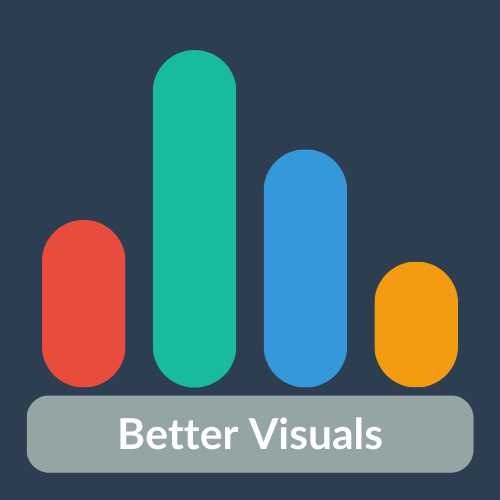

# Better Visuals

[Better Visuals](https://better-visuals.kavishhukmani.me/) is a Plotly Dash app designed to host interactive and visually appealing dashboards.

## Dashboards
* [Your Top Songs Timeline - Spotify](https://better-visuals.kavishhukmani.me/top_100/)
* [YNAB Budget Report](https://better-visuals.kavishhukmani.me/ynab/)

## Data Privacy
Better Visuals is committed to user privacy. Any data collected is anonymized and not used for commercial purposes. The data is only used to track metrics and conduct educational analysis at an aggregated level.

## Contributing
We welcome contributions to Better Visuals. Feel free to open an issue or submit a pull request if you have any suggestions or improvements.

## License

This project is licensed under the MIT License - see the [LICENSE](LICENSE) file for details.
